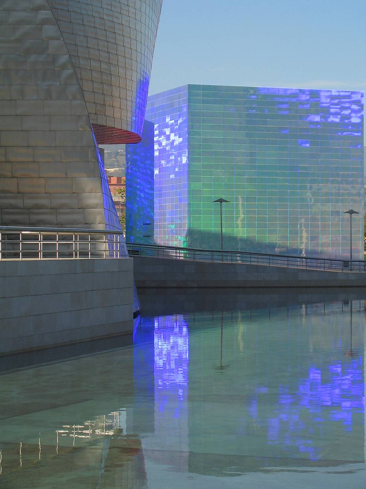
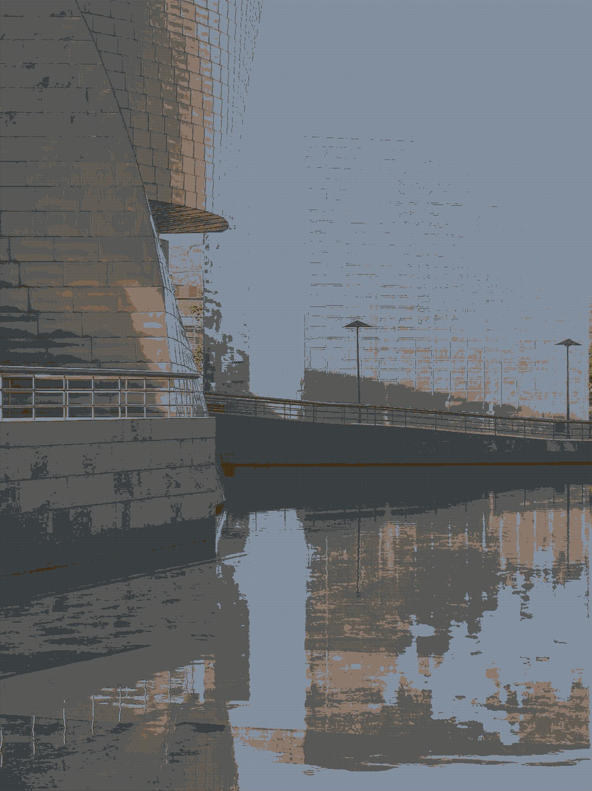

# Assemble an image mosaic

This utility makes photo mosaics. It's fast and can make mosaics of any
size using only a small amount of memory.

For example, given this set of tile images:


And this image to be processed:



You can run the program like this:

```
$ cd images
$ ../mosaic.py tiles sample.jpg x.png
```

To make this 15552 x 20736 pixel output image. 



It takes about 30s on this 2015 laptop and needs a maximum of 70mb of memory.

It uses [pyvips](https://pypi.org/project/pyvips/), so you'll need to install
that before you can run it.

